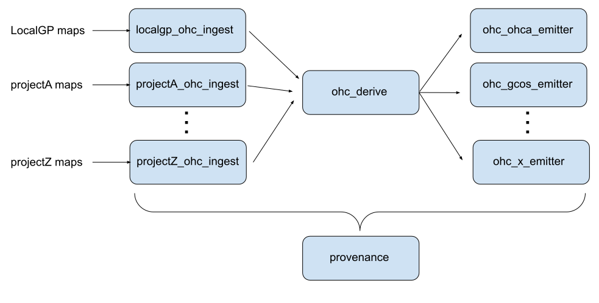

# Ocean Grid Processing

This organization collects pipeline elements for consuming gridded ocean products and processing them in projects like ME4OH.

## The ME4OH Pipeline

The ME4OH project provides a specification for submissions [here](https://zenodo.org/records/10291852), but standardization to that specification and performing analysis tasks with the resulting files remains an exercise. A collection of repositories in this organization establish pipeline elements to perform these tasks in the following workflow:

- ***_ohc_ingest** components are shims meant to take any arbitrary upstream gridded product, and produce output consistent with the [ME4OH project specification](https://zenodo.org/records/10291852); for example, `localgp_ohc_ingest` conforms LocalGP output to this standard. Furthermore, we allow one generalization of the ME4OH standard, in order to accommodate ensembles around the mean, where available: these ensemble files should be identical to the netCDF files described in the specification, but contain one extra dimension `MEMBER` (in addition to the usual `LONGITUDE`, `LATITUDE`, `TIME`), which indexes realizations of the field pulled from its distribution. *Please note is expected that all teams participating in the ME4OH project to produce their own such shim and contribute files comforming to the established spec.*
- **ohc_derive** consumes ME4OH-compliant mean fields and optionally the analogous ensemble pulls, and computes quantities of interest, like anomalies with various baselines removed, trends, annualizations and other values, optionally also computes the standard deviation of their ensembles to report as an uncertainty. Ingest shims all fan in to this pipeline step, which also combines upstream levels into synthetic levels, where desired.
- **ohc_*_emitter** components accept generic `ohc_derive` outputs and recast them to the format specifications of downstream consumers. No physics should be getting done in the emitters; these are final packaging steps only.

Outside of this pipeline sits **provenance**, which holds a record of full pipeline provenance for complete runs; files produced by each pipeline component contain a `provenance_tag` and `provenance_link` metadata pointing to information in this repository that explains the full pipeline execution for a given run, including upstream input data identification and pipeline component versions. Furthermore, each pipeline step captures configuration options set at runtime as metadata in each output file to persist a record of exactly what code and configurations generated each file.

See each repository for documentation and examples on how to run them; each should contain slurm scripts exemplifying how we scheduled these at CU.
